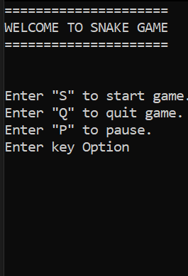
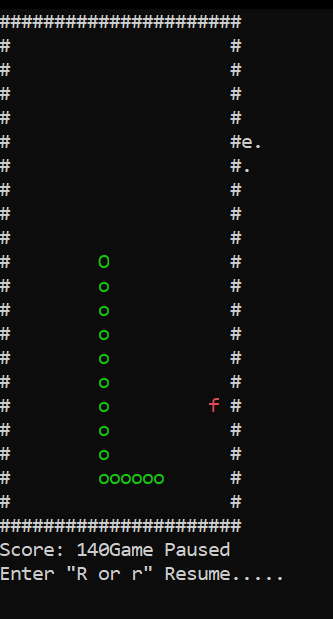

# Snake Game 
Snake Game – C++ Console Version
A simple but fully functional console-based Snake Game built using C++.
The game demonstrates real-time input handling, collision detection, tail-following logic, procedural programming, and efficient console rendering using Windows API cursor manipulation.

📸 

Menu page 

Console page 
 # Introduction
This project is a terminal/command-line Snake Game implemented in C++.
It was built to demonstrate:
1. Real-time keyboard input using kbhit() and _getch()
2. Game loop architecture (Draw → Input → Logic)
3. Snake movement using direction states
4. Fruit collision and score handling
5. Tail-growing mechanics
6. Console rendering using cursor repositioning
7. Clean procedural C++ code structure
8. Debugging and stepping through game states in Visual Studio
9. The game runs entirely in the Windows console and is lightweight and fast.

## Tech Stack
#### Component	Technology
Language	C++
IDE	Visual Studio
OS	Windows
Input Handling	<conio.h> _kbhit() _getch()
Rendering	SetConsoleCursorPosition()

# System Architecture
Below is a visual architecture diagram showing how the game components interact.
┌──────────────────────────────────────────────────────────┐
│                     Snake Game System                     │
└──────────────────────────────────────────────────────────┘
               │
               ▼
┌──────────────────────────────────────────────────────────┐
│                    Game Entry Point                      │
│                       main.cpp                           │
│ - Initializes game                                       │
│ - Starts the main game loop                              │
│ - Calls update + render functions                        │
└──────────────────────────────────────────────────────────┘
               │
               ▼
┌──────────────────────────────────────────────────────────┐
│                     Game Manager                         │
│                    (Game Engine)                         │
│ - Handles game state                                     │
│ - Reads user input (W/A/S/D)                             │
│ - Updates snake position                                 │
│ - Checks collisions (walls, self)                        │
│ - Places food & updates score                            │
└──────────────────────────────────────────────────────────┘
        │                           │
        │                           │
        ▼                           ▼
┌──────────────────────┐    ┌────────────────────────┐
│     Snake Module      │    │     Food Module        │
│  - Snake body list    │    │ - Random food spawn    │
│  - Movement logic     │    │ - Detect eaten by snake│
│  - Growth handling    │    └────────────────────────┘
└──────────────────────┘
        │
        ▼
┌──────────────────────────────────────────────────────────┐
│                    Rendering System                       │
│              Console Rendering Utilities                  │
│ - Draw snake, food, walls                                 │
│ - Clear / redraw frame                                    │
│ - Uses Windows API (SetConsoleCursorPosition, etc.)       │
└──────────────────────────────────────────────────────────┘
        │
        ▼
┌──────────────────────────────────────────────────────────┐
│                 Input Handling Layer                      │
│ - Non-blocking keyboard read (GetAsyncKeyState)           │
│ - Directions mapped to game actions                       │
└────────────────────────────────────────────────────────────────┘

# Installation & Running
1. Clone the repository
git clone <your-repo-url>
2. Open the project
Launch Visual Studio
Open the .sln file
3. Build
Build → Build Solution
4. Run the Game
Debug → Start Without Debugging

#  Controls
      Key	Action
      W	Move Up
      A	Move Left
      S	Move Down
      D	Move Right
      P	Pause
      R	Resume
      X	Exit Game
# Project Structure
Snake/
│
├── Snake.cpp        # Main game file
├── README.md        # Project documentation
└── Images/        screenshots

### Known Issues
1. Console flickering may occur because of clearing + redrawing the frame.

## Future Improvements
Add difficulty levels (speed changes)
Add a proper game over screen
Replace text rendering with color blocks
Add a high score save system (file I/O)
Implement smoother rendering using double buffering
Add sound effects using PlaySound()
Add obstacles mode

### Feedback
Always welcome in my socials.
